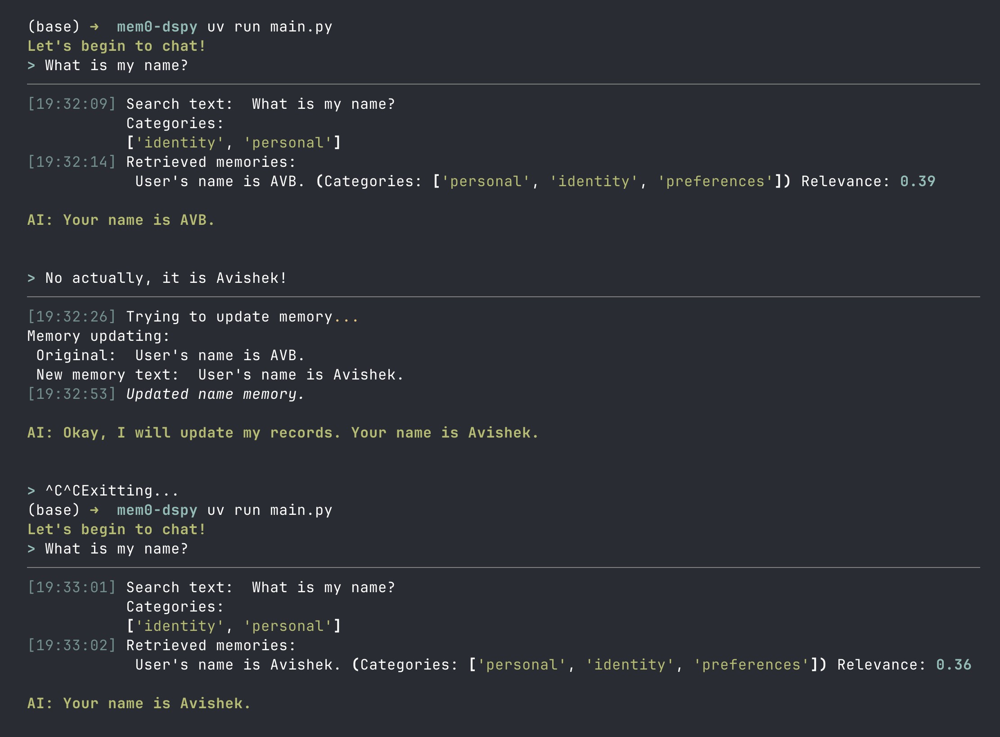

# Memory-Enabled Chatbot with DSPy

This repository demonstrates building intelligent memory-enabled chatbots using **DSPy** and **Qdrant** for persistent conversational memory. I implemented the core features from Mem0 API from scratch to showcase what it truly takes to give memory to LLMs.



Simple code that does gives long-term, cross-session, user-scoped, attributes-tagged memory to LLMs.


> **📺 Watch the Full video for free**  
> **[How to build your own long-term Agentic Memory System for LLMs | Mem0 from scratch in DSPy](https://youtu.be/n4GPdsQnHqc)**  

## Support

If you find this content helpful, please consider supporting my work on Patreon. Your support helps me create more in-depth tutorials and content. My Patreon hosts all the code, projects, slides, write-ups I have ever made on my YouTube channel. 

[](https://www.patreon.com/NeuralBreakdownwithAVB)


## Relevant external links

The architecture is inspired heavily by Mem0. Here are some links to get started with Mem0.

- Check out Mem0 here: https://mem0.dev/avb
- Mem0 Github - https://mem0.dev/github/avb
- Get Mem0 API Key - https://mem0.dev/api-keys-avb
- Mem0 Paper: https://arxiv.org/abs/2504.19413

I also used QDrant as my vector database, and DSPy to generate structured outputs and do tool-calls.

- QDrant: https://qdrant.tech/
- Self hosting Qdrant: https://qdrant.tech/documentation/quickstart/
- DSPy: https://dspy.ai/

## Features

- **Persistent Memory**: Store and retrieve user-specific memories using vector similarity search
- **Smart Retrieval**: Category-based memory organization with semantic search
- **ReAct Agents**: Tool-calling agents powered by DSPy for intelligent memory management
-  **Memory Operations**: Add, update, delete, and merge memories automatically
- **Async Architecture**: Built with async/await for efficient concurrent operations
- **Qdrant Integration**: Local vector database for fast similarity search


## Running the code

To run the memory-enabled chatbot, first follow the installation process listed below. Crucially, you must set up the environment variables, have a Qdrant server running, and then run the following command:
```
uv run main.py
```

You can also add a user_id when running main.py.
```
uv run main.py 2
```

Note that user_id needs to be an integer. All memories are user-scoped.


## Getting Started

### Prerequisites

-   **Python 3.10+** (required)
-   **`uv`** (recommended) or `pip` for package management
-   **Qdrant** running locally (or use Qdrant Cloud)

### Installation

1.  **Clone the repository:**
    ```bash
    git clone https://github.com/avbiswas/mem0-dspy
    cd mem0-dspy
    ```

2.  **Install dependencies:**
    ```bash
    # Using uv (recommended)
    uv sync
    ```

3.  **Start Qdrant (for the custom implementation):**
    Follow the [Qdrant installation guide](https://qdrant.tech/documentation/quickstart/)
    
    **Option 1: Using Docker**
    ```
    docker run -p 6333:6333 -p 6334:6334 -v "$(pwd)/qdrant_storage:/qdrant/storage:z" qdrant/qdrant
    ```

    **Option 2: Alternatively you can create a new free Qdrant cluster**
    

4.  **Set up your API keys:**
    
    **Required API Keys:**
    - `OPENAI_API_KEY` - For OpenAI models (embeddings and chat)

    `gpt-5-mini` is hardcoded at certain sections of the code. Feel free to overwrite it, or hide model names behind a config file!

    To run the `basic_mem0_chatbot.py` script, you will also need a MEM0_API_KEY. [Get Mem0 API Key here](https://mem0.dev/api-keys-avb)

    
    **Environment Management Options:**
    
    **Option 1: Using `direnv` (Recommended)**
    ```bash
    # Install direnv first, then create .envrc file
    echo "export OPENAI_API_KEY=your_key_here" >> .envrc
    direnv allow
    ```
    
    **Option 2: Using `.env` file with python-dotenv**
    ```bash
    # Create .env file
    touch .env
    ```
    Add your keys to `.env`:
    ```env
    OPENAI_API_KEY=your_key_here
    ```
    *Note: This requires adding `dotenv.load_dotenv()` to your Python scripts.*
    
    **Option 3: Export environment variables**
    ```bash
    export OPENAI_API_KEY=your_key_here
    ```

5.  **Initialize the Qdrant collection:**
    ```bash
    uv run python -m mem.vectordb
    ```

6.  **Run the chatbot:**
    ```bash
    # Custom implementation with DSPy and Qdrant
    # Default user_id (1)
    uv run main.py
    
    # Or specify a custom user_id
    uv run main.py <user_id>
    # Example: uv run main.py 42
    
    # Or the basic mem0 implementation
    uv run python basic_mem0_chatbot.py
    ```

## Recommended changes to do before you can use in Prod

- **Background Processes** : A lot of the code is structured to showcase how memory retrieval works. If you are thinking to use this in prod, I will recommend to run some of the code (especially about memory upkeeping) as a background process instead of a blocking call.
- **In-session memory management**: Summarize multi-turn chat into a single string when they reach a certain length. The current code keeps passing the entire history of chat into the LLM at each step. This could be slow if you're not hitting KV Cache.
- Better **UI/UX experience** optimized to lower Time-to-first-token
- **Create a config file** that contains runtime configurations. Some important ones are:
    - LLMs used for retrieval/updating/response gen
    - Embedding size of text vectors
- **Logging, Tracing, Error Handling** at various stages of the code

## Project Structure

### Main Files

-   **`main.py`**: Entry point for the custom memory-enabled chatbot
-   **`basic_mem0_chatbot.py`**: Simple implementation using the `mem0` library

### Memory Module (`mem/`)

-   **`response_generator.py`**: Core chatbot logic with ReAct agent for response generation and memory search
-   **`update_memory.py`**: ReAct agent for intelligent memory management (add/update/delete operations)
-   **`vectordb.py`**: Qdrant integration for vector storage and retrieval operations
-   **`generate_embeddings.py`**: OpenAI embedding generation utilities

## How It Works

### 1. Basic Flow

User Input → Search Memories → Generate Response → Update Memory (if needed) → Display Response

### 2. Memory Management

The system uses a **ReAct agent** to intelligently decide whether to:
- **ADD**: Create new memories for novel information
- **UPDATE**: Enhance existing memories with richer details
- **DELETE**: Remove outdated or redundant memories
- **NOOP**: Take no action when memory is already accurate

### 3. Memory Retrieval

Memories are:
- Embedded using OpenAI's `text-embedding-3-small` model (64 dimensions)
- Stored in Qdrant with metadata (categories, user_id, date)
- Retrieved using semantic similarity with configurable score thresholds
- Organized by categories for efficient filtering


## Contributing

Feel free to fork and customize it your own repositories. I will not be accepting pull requests nor maintaining this code!

## License

See the LICENSE file for details.
